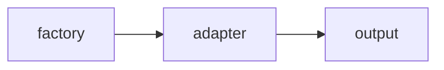
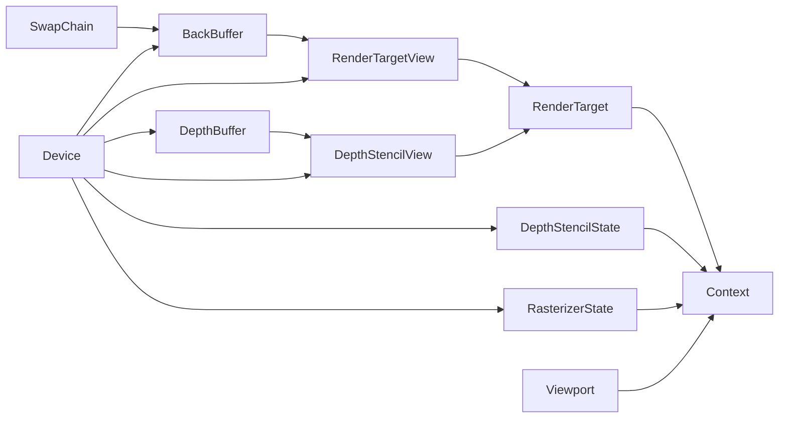

# DX的管线

# 需要的东西

## COM组件

```mermaid
graph LR
    factory-->adapter
    adapter-->output
```

output可以列举显示模式

COM组件一旦获得就需要显示释放

## 初始化管线

```mermaid
graph LR
    SwapChain-->BackBuffer
    BackBuffer-->RenderTargetView
    RenderTargetView-->RenderTarget
    DepthBuffer-->DepthStencilView
    DepthStencilView-->RenderTarget
    RenderTarget-->Context
    DepthStencilState-->Context
    RasterizerState-->Context
    Viewport-->Context
    Device-->BackBuffer
    Device-->RenderTargetView
    Device-->DepthBuffer
    Device-->DepthStencilView
    Device-->DepthStencilState
    Device-->RasterizerState
```

## 绘制管线

### VB

### IB

### VS

### PS

### HLSL
